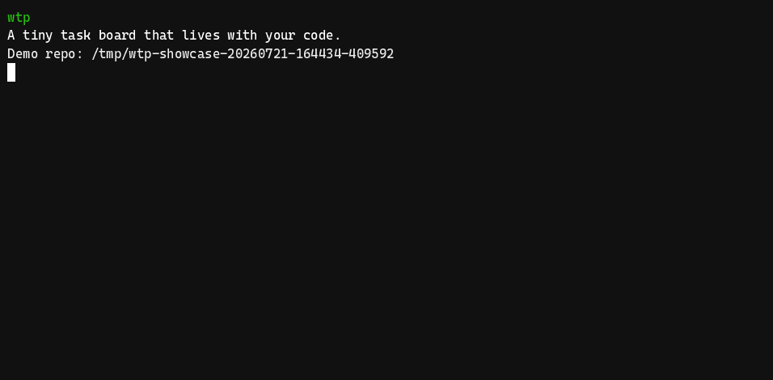

# wtp

`wtp` is a small command-line task manager for repositories. Keep work close to the code, let agents coordinate safely, and get on with the good bit: making things.

It stores tasks as readable files in the repository, so there is no hosted service or account to set up.



## Agent skills

We recommend installing the repository's coding-agent skills before setting up
`wtp`:

```sh
npx skills add mattrandles/wtproj
```

The included `setup-wtp` skill can install or update the latest production
release and help choose and configure task storage. For example, give an agent
this prompt:

> Install the WTP skills from `mattrandles/wtproj`, then use `$setup-wtp` to
> install or update WTP from the latest GitHub Release and configure it for this
> repository. Ask me where task data should live and whether I need custom task
> states.

## Install

[GitHub Releases](https://github.com/mattrandles/wtproj/releases) are the sole
supported distribution channel. Releases contain standalone, uncompressed
executables and `checksums.txt`; there are no package-manager or installer
releases. Source builds are for contributors, not a supported install or
upgrade path.

Choose the exact asset for your platform:

| Platform | Asset |
| --- | --- |
| macOS AMD64 | `wtp_darwin_amd64` |
| macOS Apple silicon | `wtp_darwin_arm64` |
| Linux AMD64 | `wtp_linux_amd64` |
| Linux ARM64 | `wtp_linux_arm64` |
| Windows AMD64 | `wtp_windows_amd64.exe` |
| Windows ARM64 | `wtp_windows_arm64.exe` |

Download the executable and `checksums.txt` from the same release, verify its
SHA-256 checksum, then place it on your `PATH`. The examples use GitHub's
`latest/download` URL; replace `latest` with a release tag to pin a version.

### macOS and Linux

This example is for Linux AMD64. Set `asset` to the matching Unix filename
from the table for another platform.

```sh
asset=wtp_linux_amd64
base=https://github.com/mattrandles/wtproj/releases/latest/download
curl --fail --location --remote-name "$base/$asset"
curl --fail --location --remote-name "$base/checksums.txt"
grep -F "  $asset" checksums.txt | sha256sum --check --status -
chmod 755 "$asset"
mkdir -p "$HOME/.local/bin"
install -m 755 "$asset" "$HOME/.local/bin/wtp"
```

On macOS, use this checksum command instead:

```sh
grep -F "  $asset" checksums.txt | shasum --algorithm 256 --check --status -
```

Add `~/.local/bin` to your `PATH` if needed, then confirm the installation:

```sh
wtp version
```

### Windows (PowerShell)

This example is for AMD64. Change `$asset` to `wtp_windows_arm64.exe` on
Windows ARM64.

```powershell
$asset = "wtp_windows_amd64.exe"
$base = "https://github.com/mattrandles/wtproj/releases/latest/download"
Invoke-WebRequest "$base/$asset" -OutFile $asset
Invoke-WebRequest "$base/checksums.txt" -OutFile checksums.txt
$line = @(Get-Content checksums.txt | Where-Object { $_ -match "  $([regex]::Escape($asset))$" })
if ($line.Count -ne 1) { throw "checksums.txt must contain one entry for $asset" }
$expected = $line[0].Substring(0, 64)
$actual = (Get-FileHash $asset -Algorithm SHA256).Hash.ToLowerInvariant()
if ($actual -ne $expected) { throw "SHA-256 verification failed for $asset" }

$userBin = Join-Path $HOME "bin"
New-Item -ItemType Directory -Force $userBin | Out-Null
Move-Item $asset (Join-Path $userBin "wtp.exe")
[Environment]::SetEnvironmentVariable("Path", "$userBin;" + [Environment]::GetEnvironmentVariable("Path", "User"), "User")
$env:Path = "$userBin;$env:Path"
wtp version
```

Open a new terminal after changing a persistent `PATH`. A global install or
update needs permission to write both the executable and its directory.

## Updating

Run `wtp update` to install a newer stable GitHub Release over the executable
that is actually running. It selects only your matching platform asset and
checks its `checksums.txt` SHA-256 entry before replacement. Equal or older
releases are a no-op, development builds cannot self-update, and prereleases
must be installed manually from their release page.

If release discovery, download, or validation fails, the installed executable
is left untouched. Unix replacement is atomic and follows a launch symlink to
its target; Windows completes its verified replacement with a helper after
`wtp.exe` exits and reports any deferred failure beside the executable.

For the complete asset, checksum, API lookup, and updater contract, see the
[GitHub Release asset contract](docs/release-assets.md). Maintainers can use
the [direct-download release QA guide](docs/release-qa.md) for the release
verification harness.

## Everyday workflow

Run `wtp` from the repository or worktree you want to manage. A typical loop
looks like this:

```sh
# Add work, then inspect what is ready without changing it. The first command
# returns the task's short ID; keep and reuse that exact value below.
task_id="$(wtp task create --title "Implement parser" --priority high --estimate m --lane cli | sed -n '1s/ .*//p')"
printf 'Created %s\n' "$task_id"
wtp task ready --agent Tony

# Claim that returned task atomically, record progress, and finish it.
wtp task start "$task_id" --agent Tony
wtp task comment "$task_id" --agent Tony --message "Parser implemented"
wtp task done "$task_id"

# Explore work and export a portable snapshot when useful.
wtp task list
wtp task show "$task_id"
wtp export --out .wtp-export
```

`task next` is deliberately not read-only: it claims the next eligible task
under a repository-local lock, preventing two local agents from claiming the
same work. Use `task ready` to preview eligible tasks. `wtp help` lists every
command; `wtp schema` documents the task-file and interoperability contract.

### Focused batch edits

Use the batch commands when several existing tasks need the same focused edit.
Export first, edit only the fields you intend to change, then import the file:

```sh
# Select every todo task, inferring JSON from the destination suffix.
wtp batch export --status todo --out todo-edits.json

# Or select exact tasks, preserving the repeated selector order.
wtp batch export --task "$task_id" --task wtp-0007 --out task-edits.csv

# Edit todo-edits.json or task-edits.csv, then publish all rows together.
wtp batch import --in todo-edits.json
wtp batch import --in task-edits.csv
```

`batch export` accepts `--status STATUS` together with any combination of the
six grouping selectors (`--issue-id`, `--project`, `--milestone`, `--version`,
`--feature-id`, and `--feature`); repeatable `--task ID` options instead select
exact tasks and cannot be combined with status or grouping selectors. Omitting
selectors exports every task. IDs may be canonical UUIDs or short IDs. With a file
destination, `.json` and `.csv` infer the format; use `--format json|csv` for
stdin/stdout or another extension. `--out -` writes raw batch data to stdout,
and `batch import --in -` reads stdin; both require an explicit format. Batch
export to stdout cannot be combined with the root `--json` flag because stdout
must contain only the batch document. File exports report their destination,
format, and task count; `--json` returns
`{"count":1,"format":"json","destination":"tasks.json"}`. Import returns
`{"updated":[...],"unchanged":[...]}` with `--json`, or the two counts in
human output.

Every row carries `updatedAt`, which is required and is an optimistic stale-
write guard: import succeeds only when it still equals the task's current
timestamp. A row identifies its task with `id`, `shortId`, or both; when both
are present they must identify the same task. Each row must contain at least
one mutable patch field. The editable fields are `title`, `description`,
`status`, `priority`, `estimate`, `lane`, `model`, `issueId`, `project`,
`milestone`, `version`, `featureId`, `feature`, `gitRepo`, `gitBranch`,
`worktreeName`, `worktreeDir`, `assignee`, and `dependencies`. Title and status
must be non-empty when supplied; priority is `low|medium|high|urgent`, estimate
is `xs|s|m|l|xl`, configured statuses are accepted, paths `gitRepo` and
`worktreeDir` must be absolute, and dependencies must resolve without cycles.

JSON is version 1 and has this shape; omitted patch fields preserve their
stored values, while `null` clears an optional field (`dependencies: null`
clears all dependencies):

```json
{
  "version": 1,
  "tasks": [
    {
      "id": "25c3806a-bd1b-424d-889b-29e5b06679b8",
      "shortId": "wtp-0001",
      "updatedAt": "2026-04-21T12:34:56Z",
      "title": "Implement parser",
      "priority": "high",
      "featureId": "FEAT-7",
      "feature": "Batch editing",
      "dependencies": ["wtp-0002"]
    }
  ]
}
```

CSV uses the header `id,shortId,updatedAt,title,description,status,priority,
estimate,lane,model,issueId,project,milestone,version,featureId,feature,
gitRepo,gitBranch,worktreeName,worktreeDir,assignee,dependencies,_clear`. A
blank editable cell preserves the stored value. Put
comma-separated optional field names in `_clear` to clear them explicitly;
supported names are `description`, `priority`, `estimate`, `lane`, `model`,
`issueId`, `project`, `milestone`, `version`, `featureId`, `feature`, `gitRepo`,
`gitBranch`, `worktreeName`, `worktreeDir`, `assignee`, and `dependencies`.
Required identifiers, `updatedAt`, `title`, and `status` may not be cleared.
CSV is UTF-8 and accepts an optional BOM.

Import validates and prepares every row before publishing. Any stale,
malformed, invalid, duplicate, missing-dependency, cyclic, or invalid-status
row rejects the whole batch, so no task is changed. Changed tasks are
published under the store lock with the transient recovery journal
`.wtp/meta/batch-update.json`; a later store open recovers a prepared or
committed journal, and a journal is retained if recovery itself fails. In a
version-controlled store, ignore this journal alongside `.wtp/meta/wtp.lock`.

Batch files are editable interoperability documents, not canonical snapshots.
The root `wtp export --out DIRECTORY` (and legacy `--export-tasks=DIRECTORY`)
still writes one canonical UUID-named task JSON file plus `handoffs.json` and
does not write a batch `version` wrapper or short-ID filename set.

### Configurable statuses

Projects can append lifecycle statuses in `.wtp.json`:

```json
{
  "additionalStatuses": [
    {"name": "waitingForReview", "category": "waiting"},
    {"name": "vendorBlocked", "category": "blocked"},
    {"name": "verificationFailed", "category": "failed"}
  ]
}
```

The built-in `todo`, `inProgress`, `paused`, and `done` statuses always come
first; additional statuses retain their JSON order. Names must be lower camel
case, and categories must be `waiting`, `blocked`, or `failed`. `waiting`
requires `startedAt` and has no `completedAt`; `blocked` has neither lifecycle
timestamp; `failed` requires both timestamps. `done` and `failed` are terminal,
but only `done` resolves dependencies. Custom statuses are not eligible for
`task ready` or `task next`.

Use `task set-status <task-id> STATUS` for any configured state. The existing
`task start`, `task pause`, and `task done` commands remain aliases for the
built-in lifecycle states. The `--status` filters on `task list` and `graph`,
and the positional status accepted by `stats`, all use the active configured
catalog; `graph --status all` includes every state.

Stats `statusCounts` follows catalog order and includes zero-count buckets.
Other buckets are lexical for model, lane, and assignee, and canonical for
priority and estimate. Empty categorical values are `""` in JSON and
`(unset)` in human output. If configuration removes a status still used by a
task file, opening the store fails with an actionable error and does not alter
the existing files.

### Task IDs and branch-scoped automatic claiming

Tasks use one of these short-ID forms:

- `wtp-{8hex}-{NNNN}` for a task created on a named Git branch. `{8hex}` is
  exactly eight lowercase hexadecimal characters; `{NNNN}` is a decimal
  sequence with at least four digits.
- `wtp-NNNN` for the legacy, unscoped namespace. Existing tasks keep this
  form, and it is also used when `wtp` runs at a detached Git `HEAD` or
  outside Git.

For a named branch, `{8hex}` is the first eight lowercase hexadecimal
characters of the SHA-256 digest of the branch's exact, case-sensitive short
name. In other words, hash the branch name as its UTF-8 bytes, take the first
four digest bytes, and encode those bytes as lowercase hex. For example,
`main` hashes to `0d6e4079`, so the first task created on `main` is
`wtp-0d6e4079-0001`. Branch names are not normalized before hashing: every
named branch, including `main`, `feature/...`, release branches, and branches
whose names differ only by case, gets its own deterministic scope. A rare
32-bit token collision is detected and reported rather than sharing an
allocation sequence.

Automatic `task ready` and `task next` selection on a named branch considers
that branch's scoped tasks first, then legacy `wtp-NNNN` tasks. It never
automatically selects a task from another named branch, even if that task is
otherwise ready; foreign tasks may still appear in ordinary listings. On a
detached `HEAD` or in a non-Git directory there is no current branch scope, so
automatic selection is limited to legacy tasks. Use `wtp task start <task-id>`
when you intentionally want to start a specific task, including an older or
foreign scoped task; normal dependency and lifecycle checks still apply.

Branch-scoped IDs are tied to the branch name, not to a branch object. After
`git branch -m old-name new-name`, newly created tasks use the hash of
`new-name`; existing IDs retain the old prefix and are not renamed. The
renamed branch therefore does not automatically adopt the old scope for
`task ready`/`task next`, and `wtp` does not automatically migrate those tasks
or their files. Start an old task explicitly if that is what you intend. A
configuration change likewise does not move data; see the storage guidance
below.

The canonical `task` commands are the public interface. Existing legacy
single-action flags remain supported for compatibility.

## CLI reference

Use `wtp --json <command>` for machine-readable output from commands that
return task, graph, version, or update data. The root `--json` flag comes
before the command, for example `wtp --json task list`.

| Command | Available options |
| --- | --- |
| `wtp help` | none |
| `wtp schema` | none |
| `wtp version` | `--json` |
| `wtp update` | `--json` |
| `wtp task create` | `--title` (required), `--status`, `--description`, `--priority`, `--estimate`, `--lane`, `--model`, `--issue-id`, `--project`, `--milestone`, `--version`, `--feature-id`, `--feature`, `--git-repo`, `--git-branch`, `--worktree-name`, `--worktree-dir`, `--depends-on`, `--agent` |
| `wtp task update <task-id>` | `--status`, `--title`, `--description`, `--priority`, `--estimate`, `--lane`, `--model`, `--issue-id`, `--project`, `--milestone`, `--version`, `--feature-id`, `--feature`, `--git-repo`, `--git-branch`, `--worktree-name`, `--worktree-dir`, `--depends-on`, `--agent`; supply at least one |
| `wtp task edit <task-id>` | same options as `task update` |
| `wtp task list` | `--status`, grouping selectors (`--issue-id`, `--project`, `--milestone`, `--version`, `--feature-id`, `--feature`), `--agent` |
| `wtp task show <task-id>` | `--agent` |
| `wtp task get <task-id>` | `--agent` (`get` is an alias for `show`) |
| `wtp task start <task-id>` | `--agent` |
| `wtp task pause <task-id>` | `--agent` |
| `wtp task done <task-id>` | `--agent` |
| `wtp task set-status <task-id> STATUS` | `--agent` |
| `wtp task comment <task-id>` | `--message` (required), `--agent` |
| `wtp task ready` | grouping selectors (`--issue-id`, `--project`, `--milestone`, `--version`, `--feature-id`, `--feature`), `--agent`, `--limit` |
| `wtp task next` | grouping selectors (`--issue-id`, `--project`, `--milestone`, `--version`, `--feature-id`, `--feature`), `--agent` |
| `wtp handoff write` | `--message` (required), `--agent`, `--task`, `--replace` |
| `wtp handoff get` | `--task`, `--all-scopes`, `--limit`, `--all` |
| `wtp handoff purge` | exactly one of `--id`, `--global`, `--task`, `--all-scopes`; optional `--before` or `--older-than` |
| `wtp graph` | `--status`, grouping selectors (`--issue-id`, `--project`, `--milestone`, `--version`, `--feature-id`, `--feature`) |
| `wtp stats` | optional `--chart`, `STATUS`, and `ATTRIBUTE`, or a series metric and range |
| `wtp export` | `--out` |
| `wtp batch export` | `--out PATH|-` (required), `--format csv|json`, optional `--status STATUS` plus grouping selectors, or repeatable `--task ID` (exclusive) |
| `wtp batch import` | `--in PATH|-` (required), `--format csv|json` |

`--priority` accepts `low`, `medium`, `high`, or `urgent`; `--estimate`
accepts `xs`, `s`, `m`, `l`, or `xl`. `--status` accepts any configured status,
including project-defined statuses; `graph --status` also accepts `all`.
Graph output expands each matching task at most once. When dependency paths
converge, human output marks later occurrences as `(already shown)` and JSON
emits `{"ref":"<canonical task UUID>"}` in place of another nested task copy.
`--depends-on` takes comma-separated task IDs. `--git-repo` and
`--worktree-dir` require absolute paths. During `task update` or `task edit`,
an empty `--model=`, `--git-repo=`, `--git-branch=`, `--worktree-name=`, or
`--worktree-dir=` clears the corresponding field.

Batch commands use these exact forms:

```text
wtp batch export --out PATH|- [--format csv|json] [--status STATUS] [--issue-id ISSUE-ID] [--project PROJECT] [--milestone MILESTONE] [--version VERSION] [--feature-id FEATURE-ID] [--feature FEATURE] [--task ID ...]
wtp batch import --in PATH|- [--format csv|json]
```

The batch export file contains editable patches, not complete task snapshots.
It includes `version: 1` and `tasks` in JSON, or the documented CSV header.
`--status` selects all tasks in one configured status and may be combined with
any grouping selectors. Repeatable `--task` selects exact canonical UUIDs or
short IDs in caller order and cannot be combined with status/grouping selectors;
omitting selectors selects every task. File suffixes infer format only for `.json` and
`.csv`; stdout and unknown suffixes require `--format`. Batch import uses the
same inference rule, reads `--in -` from stdin, and validates before calling
the provider. Its JSON response is `{"updated":[...],"unchanged":[...]}`;
export file output is `{"count":1,"format":"json","destination":"PATH"}`
with `--json`, and stdout export is raw data only.

For both formats, `id` and/or `shortId` identifies each row and `updatedAt` is
required as the exact optimistic-concurrency token. The mutable fields are
`title`, `description`, `status`, `priority`, `estimate`, `lane`, `model`,
`issueId`, `project`, `milestone`, `version`, `featureId`, `feature`, `gitRepo`,
`gitBranch`, `worktreeName`, `worktreeDir`, `assignee`, and `dependencies`; each
row needs at least one of them. JSON omits fields to
preserve them and uses `null` to clear nullable fields. CSV blank cells
preserve values and `_clear` explicitly clears only optional fields. Title and
status must be non-empty; enums and configured statuses are validated, origin
paths must be absolute, dependencies must exist and remain acyclic, and status
transitions/lifecycle/dependency rules still apply. Duplicate rows or
identifiers, malformed input, stale `updatedAt`, unknown fields/headers, and
any other invalid row reject the entire import without publishing any row.
The flat-file provider uses `.wtp/meta/batch-update.json` as a transient,
version-1 prepared/committed recovery journal; it recovers that journal on
store open and retains it when recovery fails.

`wtp stats` accepts singular positional selectors. Use at most one configured
`STATUS` and one `ATTRIBUTE`; when both are present, `STATUS` comes first. The
status-only form returns the overview filtered to that status, while an
attribute-only form returns its focused breakdown. The status-before-model
compatibility form remains supported, as in `wtp stats done model`; the same
status-first rule applies to every attribute.
`status` is itself a focused attribute for status counts. The series selectors
`created` and `progressed` each take one rolling range and cannot be combined
with a status selector.

```text
wtp stats [STATUS]
wtp stats [STATUS] ATTRIBUTE
wtp stats ATTRIBUTE
wtp stats [created|progressed] STARTd-ENDd
```

`STATUS` is any configured status. `ATTRIBUTE` is one of `status`, `model`,
`lane`, `priority`, `estimate`, `assignee`, `comments`, or `dependencies`.
Configured statuses are resolved before attributes and series metrics, so a
custom status named `model` keeps the status-first meaning: `wtp stats model`
is that status's overview, and `wtp stats model model` is its model breakdown.

With `--json`, an overview contains `totalTasks`, `statusCounts`, `attributes`,
`comments`, `dependencies`, and `handoffs`, plus `status` when a status filter
is supplied. `statusCounts` contains every configured status in catalog order,
including zero-count buckets. A focused report contains `totalTasks`,
`attribute`, and exactly one of `buckets`, `comments`, or `dependencies`, plus
`status` when filtered. Focused reports do not include overview fields or
handoff metrics.

Categorical bucket objects always contain `value` and `count`. Empty model,
lane, priority, estimate, or assignee values are represented by `"value": ""`
in JSON and displayed as `(unset)` in human output. Model, lane, and assignee
values are sorted lexically; priority and estimate values use their canonical
orders.

For machine-readable output, put the root flag before the command, for example
`wtp --json stats model` or `wtp --json stats done model`. JSON is the preferred
interface for agents and scripts. Human users can request an optional chart on
a focused categorical or series query with `--chart` immediately after
`stats`, for example `wtp stats --chart model` or
`wtp stats --chart progressed 7d-0d`. `--chart` must appear before all
selectors, may be specified only once, requires a focused selector, and cannot
be combined with root `--json`. Charts preserve bucket order, align labels,
and render fixed-width bars scaled to a maximum of 32 cells: the largest
positive bucket gets 32 cells, smaller positive buckets are proportional (but
at least one cell), and zero buckets have no bar. Empty model values are shown
as `(unset)`.

Series ranges use whole-day rolling offsets such as `7d-0d`. At the command's
single UTC as-of instant, `STARTd-ENDd` resolves to the half-open UTC range
`[asOf-START*24h, asOf-END*24h)`, split into 24-hour half-open buckets. Thus
the start is included and the end is excluded; boundaries are UTC instants,
not local calendar-day boundaries. `created` counts each task's `CreatedAt`.
`progressed` counts each task once using its latest `UpdatedAt`, so it measures
the most recent update represented by the current task record rather than every
historical update.

The comments metrics are the number of selected tasks with at least one comment
and the total number of comment records. The dependency metrics are the number
of selected tasks with direct dependencies, the number of independent selected
tasks, and the total number of direct dependency entries. They count the task
records' direct entries; they do not deduplicate or expand dependencies
transitively.

Overview handoffs count retained records relevant to the selected task set.
Unfiltered reports include every global and task-scoped handoff. A
status-filtered report includes every global handoff and only task-scoped
handoffs belonging to tasks in that status. `handoffs.allStatusTotal` remains
the pre-filter total; `total`, `global`, and `taskScoped` describe the selected
set. Unrelated task-scoped records are not folded into the filtered totals.

Examples:

```sh
# Machine-readable overview; statusCounts includes every configured status.
wtp --json stats

# Focused status counts.
wtp --json stats status

# Model counts across all tasks.
wtp --json stats model

# Model counts for one status.
wtp --json stats done model

# Rolling created and progressed counts for the last seven 24-hour buckets.
wtp --json stats created 7d-0d
wtp --json stats progressed 7d-0d

# Optional human-facing charts use the same singular selectors.
wtp stats --chart model
wtp stats --chart done model
wtp stats --chart progressed 7d-0d
```

### Retained handoffs

Handoffs are durable context for a later worker. They are stored separately
from task comments and are never consumed when read or attached to a claim.
Use a global handoff for repository-wide context, or pass `--task` for one
task. Task arguments accept either a short ID such as `wtp-0001` or the
canonical task UUID.

Write or retain context with:

```sh
wtp handoff write --message "Parser context for the next worker" [--agent Tony] [--task <task-id>] [--replace]
```

Without `--task`, the record is global. Writes append by default. `--replace`
removes older records only in the selected global or task scope, then adds the
new record; records in every other scope remain. `--message` is required and
must not be blank. Human output includes the new ID, scope, `scopeCount`, and a
scope-appropriate purge command. With `--json`, the response is:

```json
{
  "handoff": {
    "id": "8b1f1f55-6d6a-4f5a-9ca1-2e91e3a72d40",
    "taskId": "25c3806a-bd1b-424d-889b-29e5b06679b8",
    "author": "Tony",
    "message": "Parser context for the next worker",
    "createdAt": "2026-04-21T12:34:56Z"
  },
  "scopeCount": 1
}
```

Read retained context with:

```sh
wtp handoff get [--task <task-id> | --all-scopes] [--limit N | --all]
```

The default is the newest global handoff (`--limit 1`). `--task` restricts
results to one task scope; `--all-scopes` includes global and task-scoped
records. `--all` returns every matching record, while `--limit N` returns the
newest N records. The scope flags conflict with each other, as do `--limit`
and `--all`. Human output hints with `--all` when more matching records exist
and with `--all-scopes --all` when another scope has records. JSON output has
this stable shape:

```json
{
  "handoffs": [],
  "totalMatching": 0,
  "hasMore": false,
  "otherScopesAvailable": false
}
```

Remove retained context with:

```sh
wtp handoff purge (--id <handoff-id> | --global | --task <task-id> | --all-scopes) [--before RFC3339 | --older-than DURATION]
```

Exactly one selector is required. `--before` and `--older-than` are
alternative cutoffs, and neither may be combined with `--id`. `--before`
accepts an RFC3339 timestamp; `--older-than` accepts a positive Go duration
such as `72h` and computes the cutoff from the current UTC time. Cutoffs are
exclusive: only records whose `createdAt` is before the cutoff are purged;
records at or after it are retained. A missing match returns `purged: 0` for a
scope selector; an unknown `--id` is an error. JSON output is
`{"purged": 1}`.

Handoff reads and claim attachment are non-consuming. When `task start
<task-id>` or `task next` claims work, the result attaches all
retained task-scoped handoffs for that task in newest-first order. Global
handoffs are not auto-attached. This attachment does not delete or mark
records as read. `task show`, `task get`, and `task list` do not attach
retained handoffs. In JSON, the claim result remains the task view and gains
an additive `handoffs` array only when records are attached.

The flat-file collection is `.wtp/handoffs.json`:

```json
{
  "handoffs": [
    {
      "id": "8b1f1f55-6d6a-4f5a-9ca1-2e91e3a72d40",
      "taskId": "25c3806a-bd1b-424d-889b-29e5b06679b8",
      "author": "Tony",
      "message": "Parser context for the next worker",
      "createdAt": "2026-04-21T12:34:56Z"
    }
  ]
}
```

`handoffs` is always an array. Each `id` is a unique canonical lowercase
UUID; `taskId` is an optional canonical task UUID (omitted means global);
`author` is optional; `message` is required and trimmed; and `createdAt` is a
required UTC RFC3339 timestamp. A missing file is compatible with an older
store and means there are no retained handoffs; reads do not create the file.
Malformed or invalid handoff JSON is rejected.

`wtp export --out <directory>` writes the exact retained collection to
`<directory>/handoffs.json`, including `{"handoffs": []}` for an empty store,
alongside the canonical task snapshots. The legacy
`--export-tasks=<directory>` action remains an alias for `export` and also
writes `handoffs.json`. The legacy task actions (`--get-next-task`,
`--get-tasks`, `--get-task`, `--set-task-in-progress`, `--set-task-paused`,
`--set-task-done`, `--add-comment`, and `--create-task`) remain supported;
handoff commands are additive and do not replace those task commands.

When a task is created inside Git, omitted Git and worktree fields default
independently from the current repository, branch, and worktree. An explicitly
supplied value, including `--git-branch=` or another intentional empty value,
overrides only that field. Detached HEAD therefore defaults to an empty branch,
and omitted metadata stays empty outside Git. Task update and edit never refresh
these values from the current invocation context.

For older automation, pass exactly one legacy action flag: `--get-next-task`,
`--get-tasks`, `--get-task`, `--set-task-in-progress`,
`--set-task-paused`, `--set-task-done`, `--add-comment`, `--create-task`, or
`--export-tasks=<directory>`. The legacy forms accept their matching options:
`--agent`, `--task-id`, `--comment`, `--title`, `--description`, `--priority`,
`--estimate`, `--lane`, `--model`, `--git-repo`, `--git-branch`,
`--worktree-name`, `--worktree-dir`, `--dependencies`, and `--status`.

## Storage and compatibility

The implemented, supported backend is local flat-file storage.
When loading a task, WTP automatically repairs a missing or too-early
`updatedAt` only when advancing it makes the task otherwise valid. The atomic
repair preserves existing task content and appends a `wtp` audit comment;
unrelated corruption is still rejected. Normal WTP mutations also keep
`updatedAt` monotonic if the system wall clock moves backward.
Inside Git, `wtp` reads `.wtp.json` only from the root of the current worktree,
including when invoked from a nested directory or linked worktree. Outside Git,
it reads `.wtp.json` only from the invocation directory. With no configuration,
flat-file tasks remain under `.wtp/` at that same location.

Set the optional `wtpDir` property to keep flat-file tasks elsewhere. Relative
values are resolved from the directory containing `.wtp.json`; absolute paths
are also accepted. The shared-store version is also available as
[`examples/wtp.json`](examples/wtp.json):

```json
{
  "wtpDir": "../shared/wtp-tasks"
}
```

This makes a shared store practical for several projects. Put the same absolute
directory in each project's root `.wtp.json`, then create tasks normally; the
recorded Git/worktree fields identify where each task originated:

```json
{
  "wtpDir": "/srv/wtp/engineering-tasks"
}
```

```sh
# Run from each project or linked worktree. Both write to the shared store.
cd ~/src/api && wtp task create --title "Add API health check"
cd ~/src/web && wtp task create --title "Render health status"
```

### Separate task history in a dedicated worktree

If task records should be version-controlled without appearing in each source
branch, keep them on an orphan task-history branch. This copy-paste recipe
keeps the linked worktree inside the project directory, but ignores that path
in the current checkout. Run it once from a normal checkout; run `wtp` from a
project checkout that contains the `.wtp.json`, and use the history worktree
for committing and syncing task records:

```sh
project_root="$(git rev-parse --show-toplevel)"
history_branch="wtp-task-history"
history_worktree="$project_root/.wtp-task-history"
exclude_file="$(git -C "$project_root" rev-parse --path-format=absolute --git-path info/exclude)"

# Keep the history worktree inside the project, but out of normal Git status.
grep -qxF '.wtp-task-history/' "$exclude_file" || printf '%s\n' '.wtp-task-history/' >> "$exclude_file"
git -C "$project_root" worktree add --orphan -b "$history_branch" "$history_worktree"

# The history branch needs only its task files; ignore both transient WTP files.
printf '%s\n' '.wtp/meta/wtp.lock' '.wtp/meta/batch-update.json' > "$history_worktree/.gitignore"

# wtpDir is relative to this .wtp.json and points into the history worktree.
# .wtp.json is local configuration; keep it in each project checkout that
# should use this store.
printf '%s\n' '{' '  "wtpDir": ".wtp-task-history/.wtp"' '}' > "$project_root/.wtp.json"

cd "$project_root"
wtp task list
git -C "$history_worktree" add .gitignore .wtp
git -C "$history_worktree" commit -m "Initialize wtp task history"
```

After creating or changing tasks, commit the changed task files from the
history worktree and sync that branch like any other branch:

```sh
git -C "$history_worktree" add .wtp
git -C "$history_worktree" commit -m "Update wtp task history"
git -C "$history_worktree" push -u origin "$history_branch"
```

Pull or otherwise synchronize the history branch before the next writer uses
the store. Keep this branch checked out in one worktree: Git normally prevents
the same branch from being checked out twice in one clone, and `wtp`'s local
lock does not resolve Git commit, pull, push, or concurrent-writer conflicts.
Coordinate one writer at a time. Back up the history branch's commits and the
working tree/store (or make a `wtp export`) rather than treating the ignored
worktree path itself as a backup. Writing, changing, or removing `.wtp.json`
only changes where `wtp` looks; it does not move, copy, or delete an existing
`.wtp/` store. Move or migrate data deliberately, after stopping writers and
keeping a backup.

The four optional origin fields are `gitRepo` (absolute primary repository
root), `gitBranch`, `worktreeName`, and `worktreeDir` (absolute current
worktree root). On `task create`, each omitted field is discovered separately;
an explicit flag overrides only that field. `gitRepo` and `worktreeDir` must be
absolute paths. For a detached HEAD, `gitBranch` is empty while the other Git
fields are still recorded. In a non-Git directory all four fields are empty
unless you pass overrides. `task update` and `task edit` preserve existing
origin fields unless their corresponding flag is supplied, so moving between
worktrees does not rewrite a task's provenance. Clear an individual field with
an empty assignment:

```sh
wtp task create --title "Imported work" \
  --git-repo /srv/src/api --git-branch main \
  --worktree-name api --worktree-dir /srv/src/api
# Replace $task_id with the exact short ID returned by task create.
wtp task update "$task_id" --git-branch= --worktree-name=
```

Tasks also accept optional grouping metadata: `issueId`, `project`,
`milestone`, `version`, `featureId`, and `feature`. `featureId` is the stable
grouping key; `feature` is its human-readable display name. Set these with
`--issue-id`, `--project`, `--milestone`, `--version`, `--feature-id`, and
`--feature` on create/update/edit. On update/edit, use an empty assignment such
as `--project=` to clear a field. Supplied create values must not be blank after
trimming.

Task files are human-readable and friendly to version control; task status is
represented by one directory per configured status. Without additional
statuses, the layout is exactly the original `todo`, `inProgress`, `paused`,
and `done` directories. `wtp`
recognizes legacy UUID-named task files and safely migrates valid files to the
current stable short-ID filenames when storage is opened. That filename
compatibility migration is separate from branch scopes: `wtp` does not
automatically migrate existing legacy short IDs or old branch-scoped IDs when
a branch or configuration changes.

### Migrating an existing store

Adding `.wtp.json` is opt-in and does not move data. Installing or updating
`wtp` likewise never moves, deletes, or migrates a project's `.wtp/` storage.
To centralize an existing project, stop concurrent writers, commit or back up
the current `.wtp/`, move it deliberately, then point the project at its new
location:

```sh
mkdir -p ~/wtp-stores
mv .wtp ~/wtp-stores/api
printf '{\n  "wtpDir": "%s"\n}\n' "$HOME/wtp-stores/api" > .wtp.json
wtp task list
```

Use a distinct destination for each existing store unless you intentionally
want one combined task list. Do not merge task files by hand: stable short IDs
are allocated per store and must remain unique. Keep the original backup until
`wtp task list` and the task metadata look correct. Removing `.wtp.json`
later returns that worktree to its default local `.wtp/`; it does not delete
the external store.

## Verification

The unified verification gate has a fast `commit` mode and a complete
`release` mode. Both modes run formatting validation, `go test ./...`,
`go vet ./...`, and the platform's isolated smoke test. The commit gate is the
normal pre-commit check:

```sh
./scripts/verify.sh commit
```

```powershell
./scripts/verify.ps1 commit
```

The mode defaults to `commit`, and `check.sh`/`check.ps1` remain compatible
aliases. Before tagging a release, run the full gate:

```sh
./scripts/verify.sh release
```

```powershell
./scripts/verify.ps1 release
```

Release mode requires Go, Git, GoReleaser 2.17.0 (the pinned workflow
version), and the shell-specific tools used by release QA.
On Unix those are PowerShell 7 (`pwsh`), `curl`, `file`, and `sha256sum` or
`shasum`; on Windows the PowerShell gate needs PowerShell and the standard
Go/Git tools. It runs GoReleaser config validation, a non-publishing
snapshot, the release-asset contract test, and direct-download release QA.
Snapshots and fixtures are written below a temporary directory; the gate does
not publish, alter the checkout, or install into a user directory.

Commit verification normally takes under a minute with a warm Go cache; allow
several minutes for release verification because it builds multiple snapshots.
The Unix gate cross-compiles and validates Windows assets but executes the
Unix updater workflow. The PowerShell gate executes the Windows workflow only
on Windows; on other hosts it still validates all generated asset checksums
and formats.

For the hermetic black-box workflow matrix, run the cross-platform Go harness
through either shell entry point:

```sh
./scripts/verify.sh prerelease --seed 1 --repeat 1 --report /tmp/wtp-qa/report.json
```

```powershell
./scripts/verify.ps1 prerelease --seed 1 --repeat 1 --timeout 30s --suite-timeout 3m --report "$env:TEMP/wtp-qa/report.json"
```

The runner defaults to 20 complete iterations. Use `--repeat 100` for a local
soak run, and pass `--candidate /absolute/path/to/wtp` (or
`--candidate C:\qa\wtp.exe` on Windows) to exercise an exact release artifact.
Run the native checks in the controlled development environments that have the
required platform access; they are deliberately not part of the GitHub release
workflow.
The report includes separate-process contention counts, process timings and
exit codes, retained failure artifacts, and the explicit `go test -race ./...`
result. See
[the pre-release test plan](docs/pre-release-test-plan.md) for the report
schema, exact quick/prerelease/soak commands, repeat comparison, retention
behavior, and the full Gate B/C1 matrix.

See the [pre-release test plan](docs/pre-release-test-plan.md) for the broader
workflow, contention, failure-recovery, native-candidate, and evidence-review
gate being tracked for release qualification.
